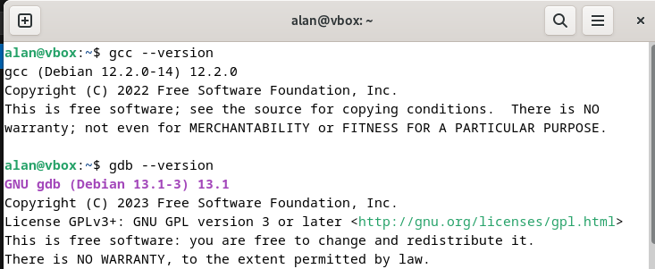
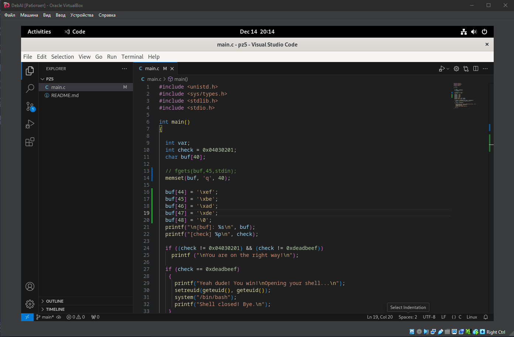
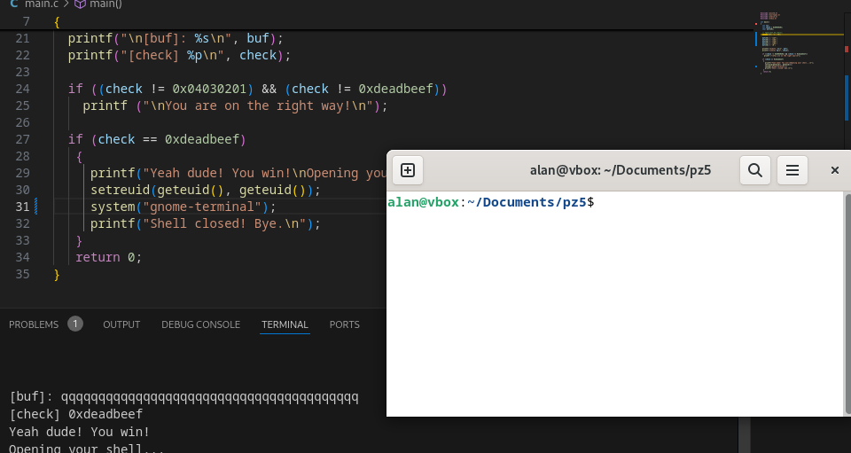

# Проверка версий gcc и gdb



# Ход работы

1. Цель динамической отладки:
 - Определить наличие уязвимости переполнения буфера.
- Использовать переполнение для изменения значения переменной check на 0xdeadbeef.

2. Добавим автоматическое заполнение буфера buf для проверки уязвимости:
``` c
memset(buf, 'q', 40); // заполняем буфер фиктивными данными
```

3. Этапы эксплуатации уязвимости:<br>
После объявления переменной buf в памяти программы сразу за ней размещается переменная check. Таким образом, переполнение буфера buf позволяет записать данные в область памяти, где хранится переменная check.
- Заполняем буфер фиктивными данными, чтобы достигнуть области памяти переменной check.
- Записываем в область памяти переменной check значение 0xdeadbeef.
    Для x86-архитектуры (Little Endian) 0xdeadbeef записывается в памяти как \xef\xbe\xad\xde.

    

- В результате чего проверка проходит и открывается консоль


# Пояснения

Переполнение буфера (buffer overflow) происходит, когда программа записывает данные в буфер (область памяти фиксированного размера) без проверки их длины. Если ввод превышает размер буфера, данные начинают записываться в соседние области памяти, которые могут содержать другие переменные или критические данные, такие как адреса возврата или управляющие переменные.<br>

### Что делает fgets(buf, 45, stdin)

- Функция fgets считывает до 45 байт из стандартного ввода (stdin) и записывает их в буфер buf, длина которого ограничена 40 байтами.
- Поскольку длина буфера меньше возможного размера ввода, fgets позволяет записать данные за пределы buf.

### Как данные выходят за границы buf? 
- Если пользователь введет строку длиной более 40 байт (например, 45 байт), данные начнут записываться в соседнюю память. В данном случае это область, где хранится переменная check.

### В чем опасность переполнения

Переполнение буфера является одной из самых серьезных уязвимостей в программном обеспечении, так как оно может быть использовано злоумышленником для изменения поведения программы, получения несанкционированного доступа или выполнения произвольного кода. 
Так например было в нашем примере, где смогли обойти проверку и открыть консоль.

# Кодревью и анализ кода

Код демонстрирует уязвимость переполнения буфера, которая позволяет злоумышленнику изменить поведение программы. Ниже представлен подробный анализ с указанием слабых мест.

1. Переменная var определена, но не используется в коде.
2. Буферная уязвимость<br>
Буфер buf имеет размер 40 байт, но функция fgets(buf, 45, stdin) позволяет считать до 44 байт. Это создаёт риск переполнения буфера, что может позволить злоумышленнику изменить содержимое стека, включая переменную check.
3. Вывод данных<br>
`printf("[check] %p\n", check);` неправильно интерпретирует переменную check как указатель. Необходимо использовать %x для вывода шестнадцатеричного значения.
4. Проверка переменной `check`
Код проверяет, изменился ли check, но условие` if ((check != 0x04030201) && (check != 0xdeadbeef))` выглядит странно. Эта проверка не имеет смысла, так как даже случайное изменение переменной вызовет вывод "You are on the right way!".
5. Открытие шелла
- Условие `if (check == 0xdeadbeef)` предоставляет способ злоумышленнику изменить переменную check, что может привести к выполнению `system("/bin/bash")`. Это уязвимость типа <b>`stack-based buffer overflow`</b>.
- Функция `setreuid(geteuid(), geteuid());` может предоставить повышенные права, что усугубляет уязвимость.
6. Общая структура программы<br>
Код не обрабатывает ошибки, не выполняет проверку на длину строки и не защищён от переполнения буфера. Это делает его уязвимым к эксплуатации.

## Исправленная версия

``` c
#include <unistd.h>
#include <sys/types.h>
#include <stdlib.h>
#include <stdio.h>
#include <string.h>

int main()
{
    int check = 0x04030201;
    char buf[40];

    printf("Enter your input (max 39 characters): ");
    if (fgets(buf, sizeof(buf), stdin) == NULL) {
        fprintf(stderr, "Error reading input.\n");
        return 1;
    }

    // Удаляем возможный символ новой строки
    buf[strcspn(buf, "\n")] = '\0';

    printf("\n[buf]: %s\n", buf);
    printf("[check]: 0x%x\n", check);

    if (check == 0xdeadbeef) {
        printf("Yeah dude! You win!\nOpening your shell...\n");
        
        // Убедимся, что ID успешно изменены
        if (setreuid(geteuid(), geteuid()) == -1) {
            perror("setreuid failed");
            return 1;
        }
        
        // Безопасно запускаем оболочку
        if (system("/bin/bash") == -1) {
            perror("system failed");
        }
        printf("Shell closed! Bye.\n");
    } else {
        printf("\nKeep trying, but securely!\n");
    }

    return 0;
}
```